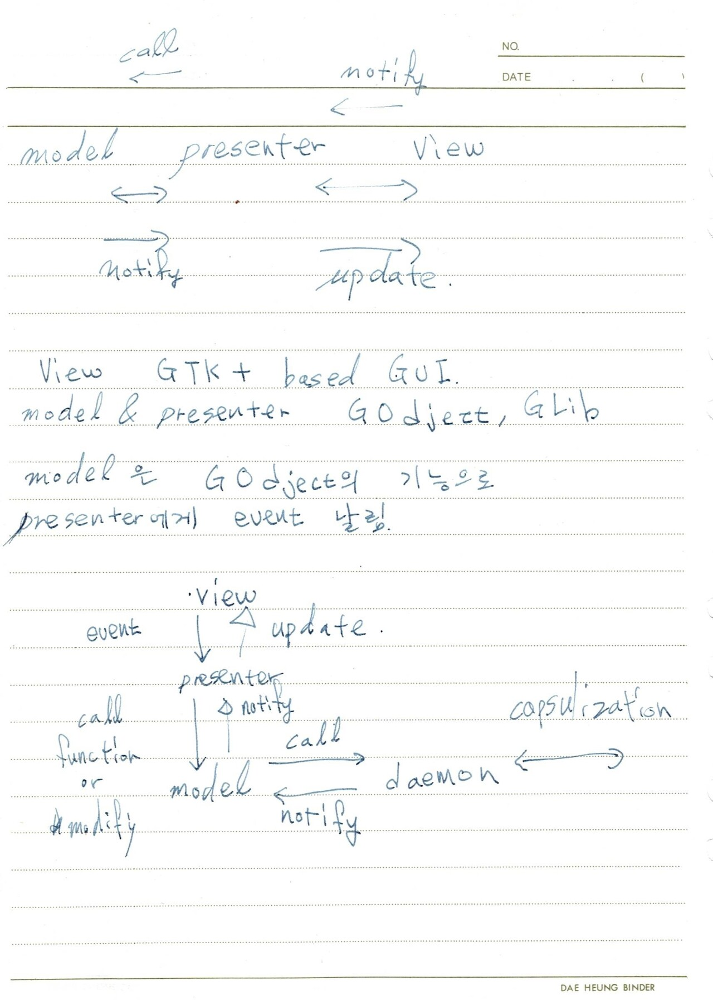

첫 주의 스터디에는 그동안 GTK나 DBUS에 대하여 모아둔 정보들을 항목마다 링크를 추가한 문서에 새로운 링크를 추가하고 대략적인 설계를 진행하였다.
대략적인 프로젝트 진행 목적 및 이 프로젝트를 진행하면서 배워야 할 내용들을 정리하였다.
국민대 소프트웨어 단과대에서 지정한 표준환경을 구축해주는 GUI앱을 제작하는 것이 이번 프로젝트의 목표이다.
GUI 툴킷은 GTK+로 정하고 패키지 관리를 맡아줄 PackageKit을 이용하여 패키지관리 서비스를 제공할 예정이다. 기반이 되는 D-BUS와 Linux에서 GUI화면이 어떻게 보여지는 지에 대한 이해와 MVP와 같은 디자인패턴을 습득할 것이다. 이번 프로젝트의 목적이 저학년생들의 환경구축에 대한 도움이기에 설치가 간단한 Debian package를 사용할 것이고, ppa를 이용하여 2-3줄 정도 되는 명령어로 접근하게 할 것이다.
 
|항목|설명|
|--|--|
|프로그램 이름|ELF(easy LabAnyWhere Fabricator)|
|서비스|데비안 계열 리눅스 배포판에서 Lab AnyWhere에서 지정한 표준환경을 구축하게 해준다.|
|배경|1,2학년들이 교내 표준 환경설정에 어려움을 느기는 문제가 매년 발생했다.|
|목적| Debian 계열 배포판에서 쉽게 표준환경 구축 GUI 이용으로 손쉬운 사용 해당 프로그램을 간단한 명령어로 손쉬운 설치|
|기대효과| 저학년의 손수위 표준환경 구축을 도와준다|
|기능|표준환경 위원회에서 지정한 패키지들 설치|
|타겟| 컴공 저학년 학생 및 타과생 같은 Ubuntu에 처음인 학생들|
|서비스 타겟|Linux application|
|배포 사이트| PPA|

간단하게 클래스를 그려보았다

