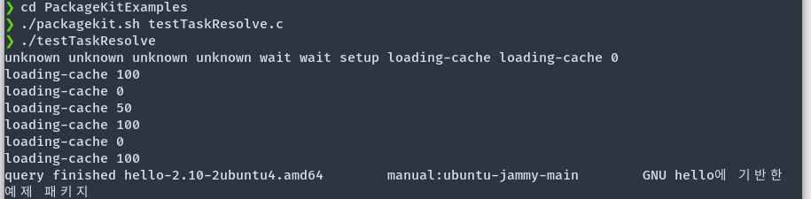

시험기간이 겹쳐 여러가지로 작성이 늦어졌다.
다국어화, 리스트뷰, 데모자료, glade를 집중적으로 보았다.
다국어화는 보다 많은 교내학생들이 사용하기 위해 자료를 찾아보았다. 일본어, 중국어(간체자, 정체자) (CJK)등의 언어는 번역이 할 수 없으나 기본적인 뼈대를 제공하여 누구든지 번역할 수 있도록 할 예정이다. FOSS에서는 gettext라는 툴을 이용하여 다국어를 지원한다. 영어를 문장을 키로 번역, 현지화된 글을 치환해 준다. 치환기준은 실행시 로케일이다.
 
이전 작성한 코드가 이것이다.
```C title=locale
pk_client_set_locale(client, g_get_language_names()[0]);
setlocale(LC_ALL, g_get_language_names()[0]);
```
위의 코드를 차라리 아래와 같이 하여 저런 긴 코드를 깔끔하게 바꾸었다.
```C title=locale
int main()
{
    setlocale(LC_ALL, "");
    //중략
```


한글이 깨짐없이 잘 나오는 걸 볼 수 있다.
 
## Listview
이번에 사용할 widget으로 Gtktreeview를 사용하려고 했으나 deprecated된 기능이라 대체된 listview를 사용하게 되었다.
이전에 cellRenderer로 특정 widget만 렌더하던거에서 widget을 직접 추가하는 방식으로 바뀌었다.
## glade
gtk에서 xml로 ui를 표현하는 방식으로  glade를 통해 WYSWYG 방식으로 제공되나 gtk4은 지원하지 않는다. 손수 .ui 파일을 작성해야한다. 컴파일을 하지 않고 ui를 바꾸는 방식이나 gnome 재단에선 gresource를 통해 c 코드 파일로 컴파일되어 빠르게 접근하게 만들었다.
## Demo & Guide Line
뷰의 사용방법 코드 작성법 예를 보여주는 gtk3-demo, gtk4-demo가 gnome 재단의 저장소에서 제공된다. 각각 apt, flatpak을 통해 설치가능하다.
앱을 이름, 아이콘, 뷰의 디자인 등의 가이드라인도 제공한다.
 
## 참고자료

* [1](https://www.labri.fr/perso/fleury/posts/programming/a-quick-gettext-tutorial.html)
* [2](https://gitlab.gnome.org/search?group_id=8&nav_source=navbar&project_id=1672&repository_ref=master&search=locale&search_code=true)
* [3](https://docs.gtk.org/gtk4/section-list-widget.html)
* [4](https://blog.gtk.org/2020/09/05/a-primer-on-gtklistview/)
* [5](https://gitlab.gnome.org/GNOME/gtk/-/tree/main/demos/gtk-demo)
* [6](https://developer.gnome.org/hig/)